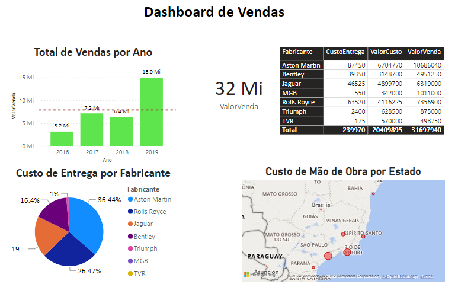
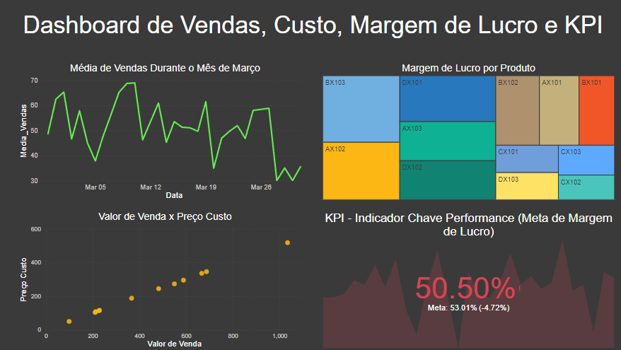
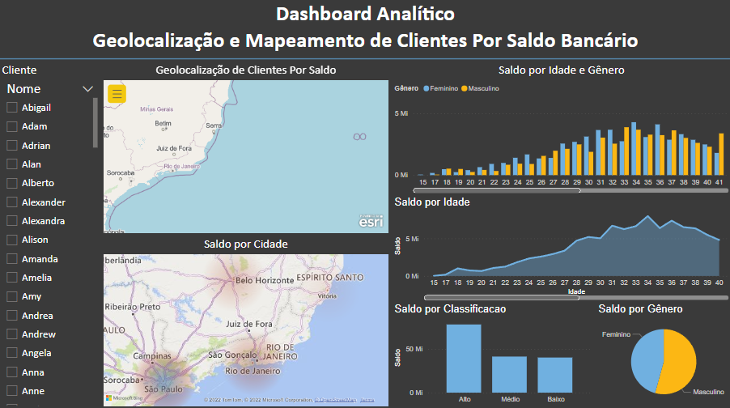
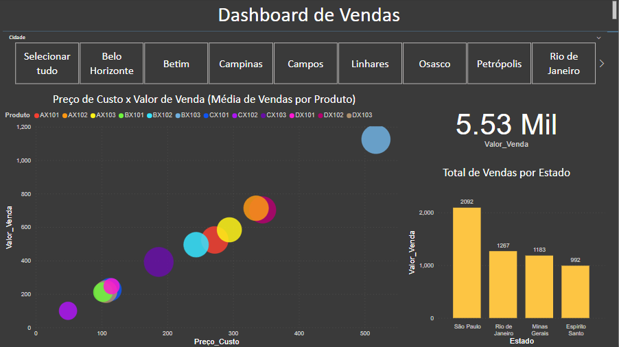
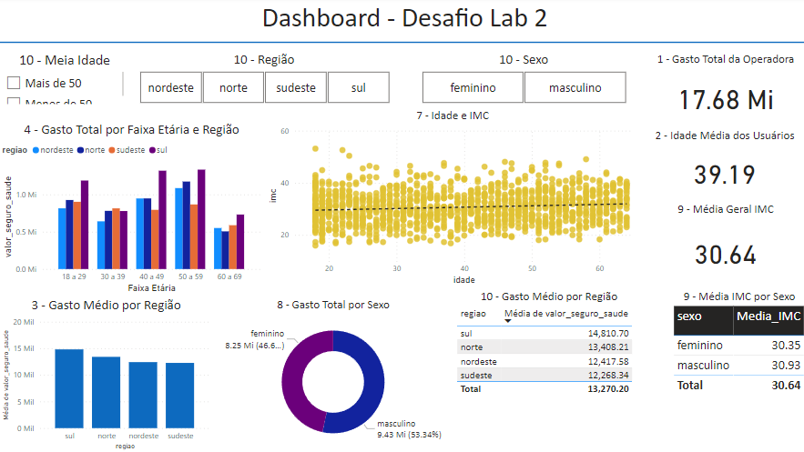
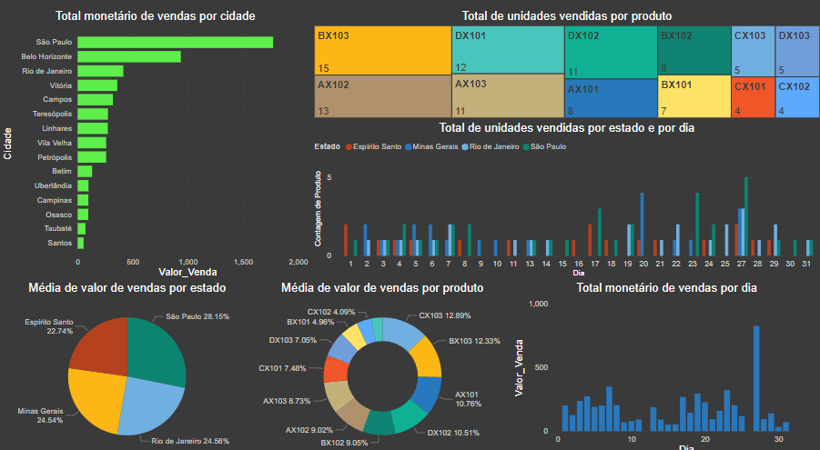
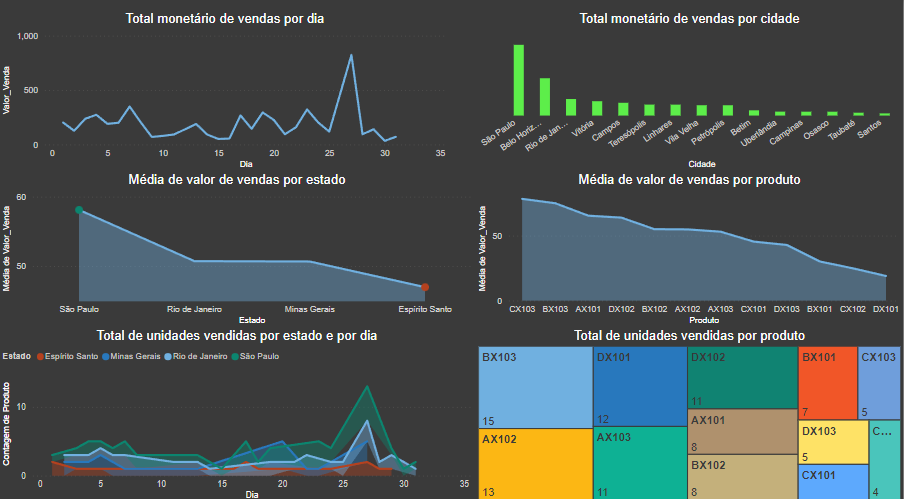
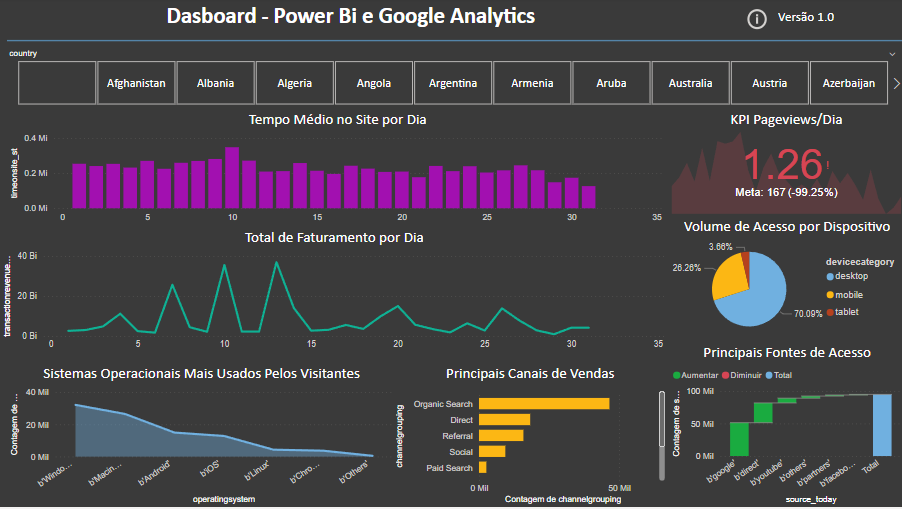
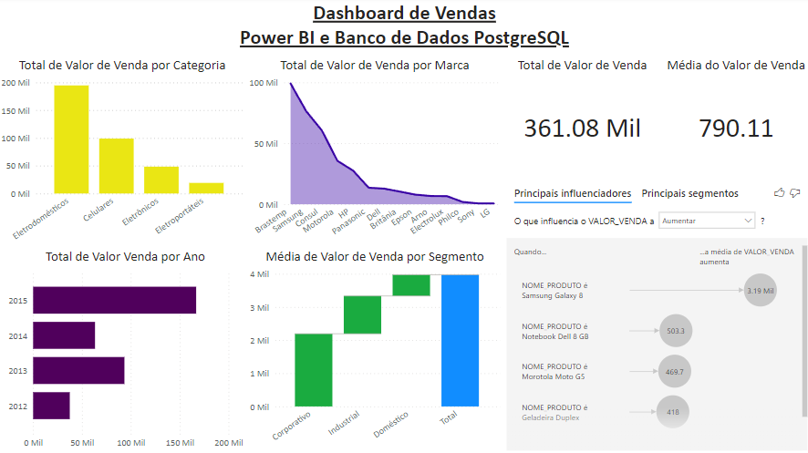
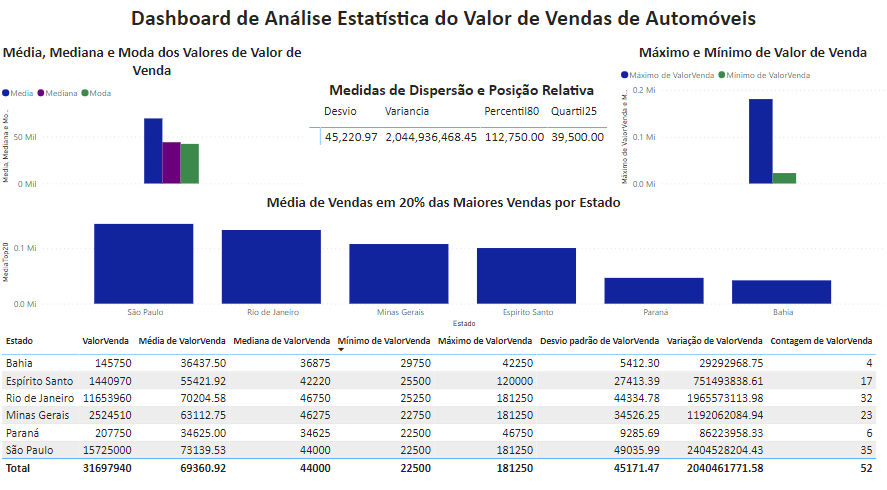

# Data Sience Power BI

Projetos feitos durante o curso de Microsoft Power BI Para Data Science - Versão 2.0, na plataforma Data Science Academy

## Alguns projetos feitos durante o curso

### Cap 02

### Cap 03

### Cap 04

### Cap 05

### Cap 06

### Cap 07-1

### Cap 07-2

### Cap 08 v1

### Cap 08 v2

### Cap 09

### Cap 10

### Cap 11
